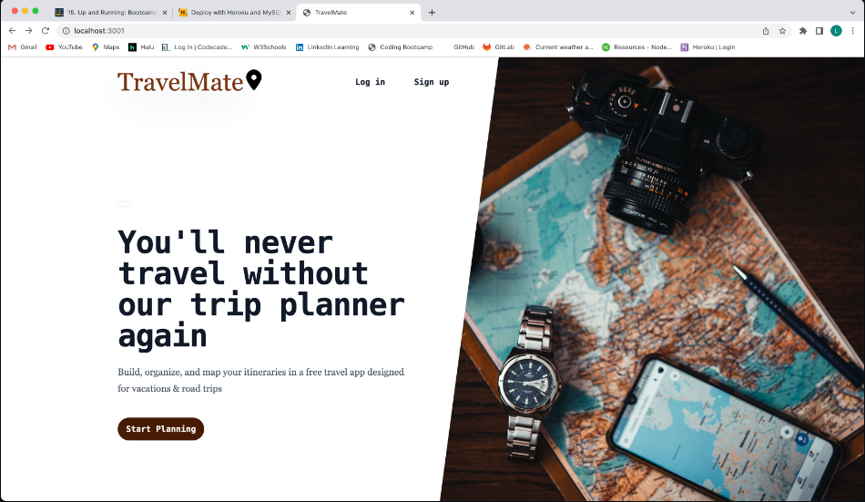
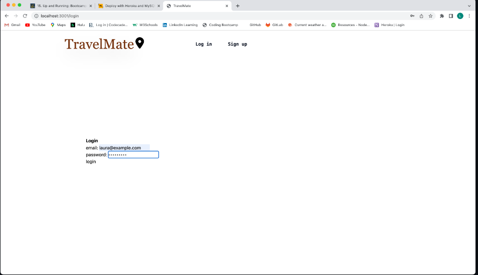

# TravelMate-LoginSignup

## Description

- This is specifically the login/signup javascript and handlerbars pages I made for this group project.

Travelmate is an application designed to help users search for, and save within their personal profile, activities happening in their travel destinations. They are able to see the name of the event, a photo, the venue, date, and a link for more information.

Using this application, the user will be able to organize and plan their trips more efficiently.

This project taught us about the work required to build a full-stack website, how well the project needs to be thought through, and how important communication is between all the team members in the project. The ambitious scope of this project created a lot more work than anticipated, and there were several components to the project that were not originally assigned to group members as well as some unforseen circumstances for individual members. This made it difficult to complete the project to our imagined specifications.

## Installation 

Please use the following link to visit TravelMate:

[TravelMate](https://cryptic-mountain-16938.herokuapp.com/)

## Visual 

Homepage of TravelMate:

To login, click on the login link from the homepage, and the login page will be displayed.

## Extras

To see full developed project..

GitHub Repository Link:

[Github Repository Link](https://github.com/Emilymora1207/TravelMate)

## Credits

TravelMate was built as a collaboration between:

-Andrey Shestopal, Main Page, User Story

-Kate Sundquist, Login/Sign Up page, wireframe, presentation

-Jacquez Drake, Search page

-Laura Hardy-Wilcox, Results page, api data, README, made homepage functional, created placeholder search, login, and signup handlebars pages, worked to improve basic functionality and connecting frontend to backend after presentation, deployment

-Emily Mora, Saved Trips page, database models, all the backend routes, styling for all the saved data handlebars pages

-Elijah Diaz, Profile page

The Ticketmaster Discovery API was used for the event information in TravelMate.

Tailwinds.css was used for the styling of the homepage and headers.

